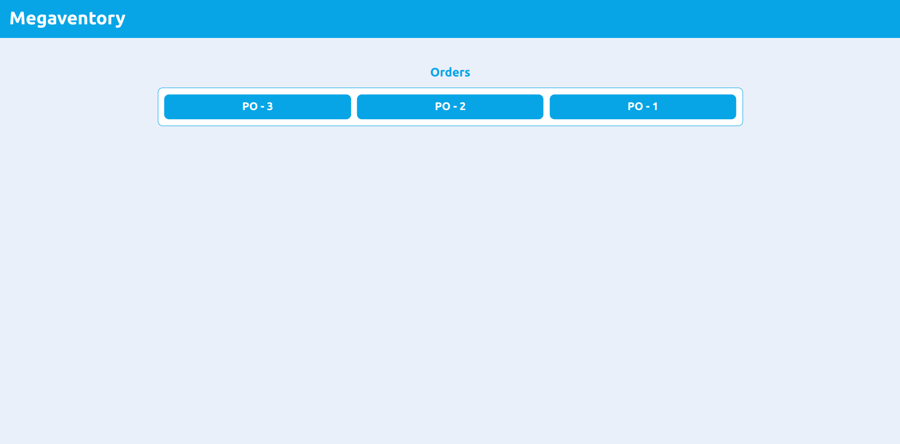
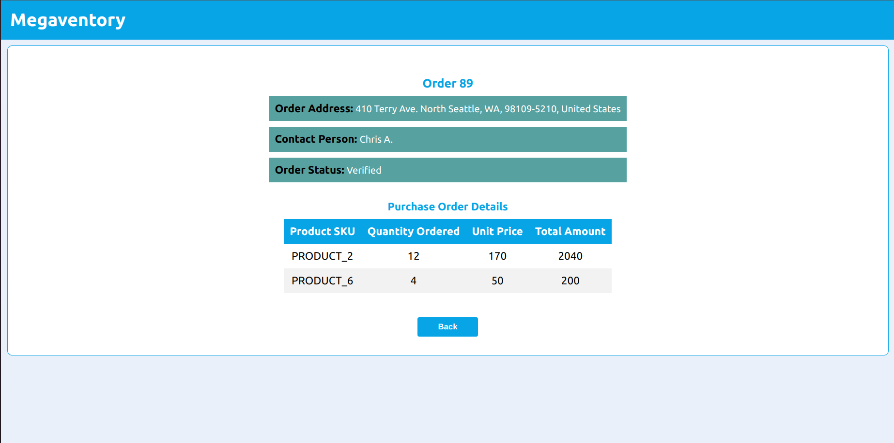

# Megaventory-Task

## Introduction

```
This task is about purchase orders page, which display the orders and their details.
```
---
## Technologies
> [React v18.2.0](https://reactjs.org/)

> [React Router v6](https://reactrouter.com/en/main)

> [Json Server](https://www.npmjs.com/package/json-server#getting-started)

---
## How to start
>  git clone git@github.com:ahmedasad236/Megaventory-Task.git

>  cd Megaventory-Task/order

>  npm install

>  npm run serve-json

>  npm start 

## Snapshots
> All orders Page

> Order Page 